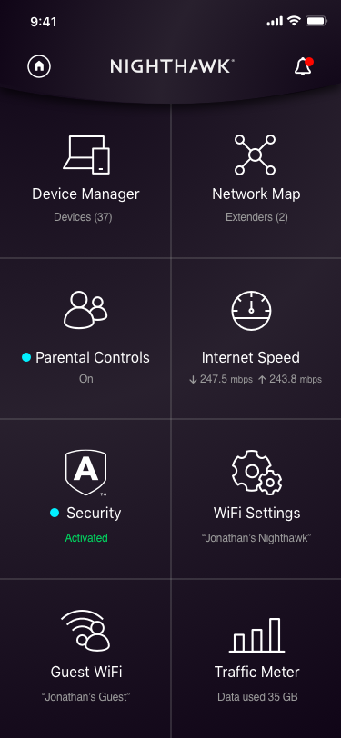

# Router Setup

### General setup
* Disable 2.4 Ghz WiFi. 
* Setup parental controls to block any potential NSFW content.

### Physical Setup
The current version of the setup uses a TP-Link Archer AX3000 router. 

Unbox the Router and sure not to throw away the plastic layer on the top of the router. There is a QR code on the cover which will be needed when paring with the router app. 

Connect the yellow ethernet cable to the back of the router. This will be the cable that connects to the hospital ethernet port.

**Ethernet Cable must be CAT7 for faster speeds**

Connect the Phillips HueBridge ethernet cable to the LAN ethernet port on our router. 

This part of the setup will be moved near the hospital ethernet port. Connect the router power to the nearest outlet. 

### Nighthawk App

Download the Netgear Nighhawk App on your phone. Use the account mischa@studioeslewhere.co when logging in. **Make sure to write whatever account details you create in the Google Spreadsheet and specify the device and room location you are setting it up for**.

At this point you will need the QR code which came with the router. This will allow you connect the phone directly to the router. You will then be able to set up a WiFi name and password. 
The app will also prompt you to create an admin account for the router. The username will stay admin and the password must be a secure **randomly generated password**. This is for security reasons regarding the hospital network.

Finally go into the app setting and **enable the anywhere access option**. This will allow us to turn the router on and off from anywhere in the world. 
You can find this options by clicking on the small home icon on the top left. Then go to settings > anywhere access.

### More Router info

Alternatively to the Nighhawk app you can use routerlogin.net when on the same network as the router. From here you can see and the connected devices on your network and their assigned IP adrress. 

**If other components of the recharge rooms are not working this is a good place to start troubleshooting from because we can check if they are even connected to internet.**

## Router Setting Setup

Go to http://routerlogin.net/

The username is always admin and the password is the same one you set during the inital setup process.

... Inital router site screen ... 

## Check connected devices 

You can check the devices connected to our network by going under the **BASIC** tab and click on Attached Devices option. It will display the devices and their assigned network IP address. 

## Assigning static IP 

You can check assign a static IP adress by going under the **ADVANCED** tab and go under setup > LAN Setup

Typically we do this to assign a static IP address on the Chromecast because the connection between the chromecast and the router sometimes can disconnect. 

Click on the device you want to edit and manaually write the IP address. Then click apply. 

