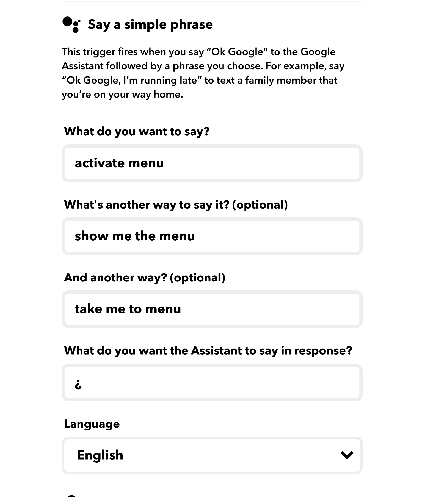
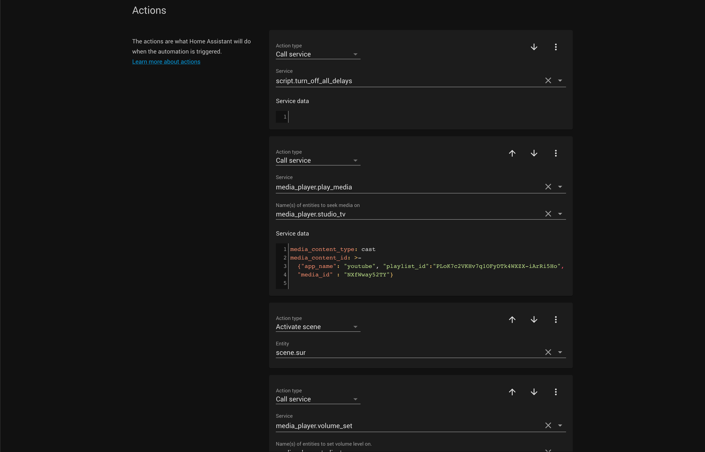
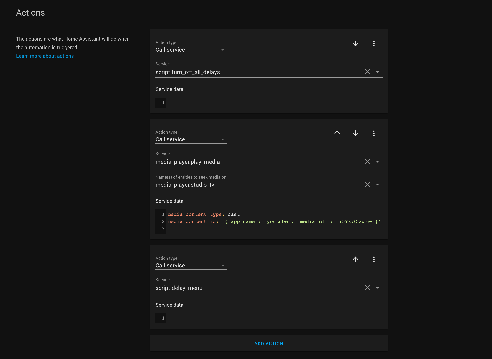

# Python Scripts
## Integrations

To add an integration go to the sidebar and click on **configuration** on the bottom left. Then go into integrations.

You can search for the integrations and add them. 

 

 ### Phillips Hue Integration. 

If you are on the same WiFi it should automatically connect with all your Phillips light devices and entities. In this case, entities are the zones/rooms you created in the Hue app. These entities will allow us to control all the lights easily when setting up scenes for the rooms. 

 ### IFTTT Integration

Before we do this we need to setup the IFTTT aplets. 

For context IFTTT serves as a middleman between two devices. In the case of the rooms when a user says a specific command to the Google Home Max on our network, a webhook is sent to Home Assisant with a specific JSON post response. Based on the JSON body content, the approapitate automation is triggered. 


* [Go to IFTTT](https://ifttt.com/home)
... you can sign up with the same google account you are using to manage the Home Assistant. 

* Create a new applet. 
* The inital IFTTT trigger device will be **Google Assistant**
* The IFTTT receiver device being called will be **Webhooks**

  * The google integration will go as follows 
      * In **What do you want to say?** write " activate **x** " ... where **x** stands for the menu or the title of the scene we are creating the webhook for 
      * You can write alternative ways of activating the webhook
      * You must include a "¿" in the response if you want Google Assistant to stay silent after you have given it a command. 

   

   * The webhook integration will go as follows 
      * For the **URL** we will use the Nabu Casa webhooks url 
      * For **Method** choose **POST**
      * For **Content Type** choose **application/json**
      * In the JSON body type { "name" : "myscenename" }
        * **All the json body names for the scenes are listed in the google doc, under the scenes tab. Please follow the same naming convention.**

   

 ### Google Cast Integration

Configure the Google Cast Integration. By default it should pick up on all the connected google devices in our network. 

## Automations Overview

In order to understand scripts and scenes we need to understand the structure of our automations first. Below is an example automation for the Big Sur video. 

### Triggers

We start with the name and the trigger. The trigger comes from IFTTT after the user has used one of our specific voice commands. 

* Name of automation = **whatever name you want**
* Trigger type  = **Event**
* Event type = **ifttt_webhook_received**
* Event data = **name: sur**
  * The event data name corresponds to the json body name we created for the IFTTT webhook 

  * You can go into the trigger compnent and edit it in YAML script. Here is an example YAML script we used for Big Sur. Make sure to keep indentation the same. 

    * To edit YAML click on the three dots on the top right of the component and click **edit as YAML**. 


```
platform: event
event_type: ifttt_webhook_received
event_data:
  name: sur
```


### Actions
Actions are what Home Assisant does after recieving a trigger. Actions can either be scenes which control our lighting or scripts which can control the timing of our videos and display them on the projector. 

We will go over the script in detail in the next section. For now lets just look at the structure. In this automation there are two delay scripts.

* script.turn_off_all_delays
  * This script resets all the delays. This way if someone switched videos midway it will stil play the full length of the video. 


* script.delay_big_sur_2 
  * The name of this script will differ by automation. This delay script is called a minute before the video ends. At which point is changes the video to the menu. 

* Play video call service
  * This is YAML script. It takes the media player which is our Chromecast, opens the Youtube app and plays our video. 

```
service: media_player.play_media
data:
  media_content_type: cast
  media_content_id: >-
    {"app_name": "youtube", "playlist_id":"PLoK7c2VKHv7q1OFyDTk4WXZX-iArRi5Ho",
    "media_id" : "NXfWway52TY"}
entity_id: media_player.studio_tv
```

* Volume video call service 

  * Sets the chromecast volume for every video. Some videos should be louder than others. 

```
service: media_player.volume_set
data:
  volume_level: '0.72'
entity_id: media_player.studio_tv
```




## Scripts
### Delay video script 

* Under the sequence section add a Delay.


For the delay amount were going to calculate the number of seconds in our video. Then we will sutract a few seconds off that number and use that.

For example the Big Sur automation plays our Emerald Cove video which 21 minutes and 6 seconds, which is 1266 seconds. Minus a few seconds we could write 1263. 

  * Call the menu. 
Here we have a nested automation which is called at the end of the Big Sur automation. If we look at the menu automation it follows the same pattern we layed out above. 
    * Turn off all delays 
    * Cast menu videos 
    * Delay Menu 




### Turn off all delays

In the sequence section of this script we do a call service on every individual video delay script and turn them off. The menu video delay script included. 

The service type will be **script.turn_off**


## Scenes
Under scenes we can choose our individual lights or we can choose a zone and set the color/brightness/temperature. We can then call these in the automation section. 


## Configurations
At the bottom of the sidebar on Home Assistant you can click the Supervisor tab. Here you can add extensions to Home Assistant. Add the File Editor extension.

The file editor tab should now appear on the sidebar. Click on it and on the folder icon navigate to /config/configuration.yaml .

From here you can specify special condtions that we need our system to have. For example you can specify the Media Extractor which is in charge of supplying our youtube video URL to chromecast during our automations.

Here is an example configuration yaml from the Recharge room at Brockton Signature Hospital. 


```

# Configure a default setup of Home Assistant (frontend, api, etc)
default_config:

# Text to speech
tts:
  - platform: google_translate

group: !include groups.yaml
automation: !include automations.yaml
script: !include scripts.yaml
scene: !include scenes.yaml

hue:
  bridges:
    - host: 192.168.1.4
      allow_unreachable: true
      allow_hue_groups: true

media_extractor:
  customize:
    media_player.studio_tv:
      'video/youtube': bestvideo[height=2160]+bestaudio
```


## Other features


