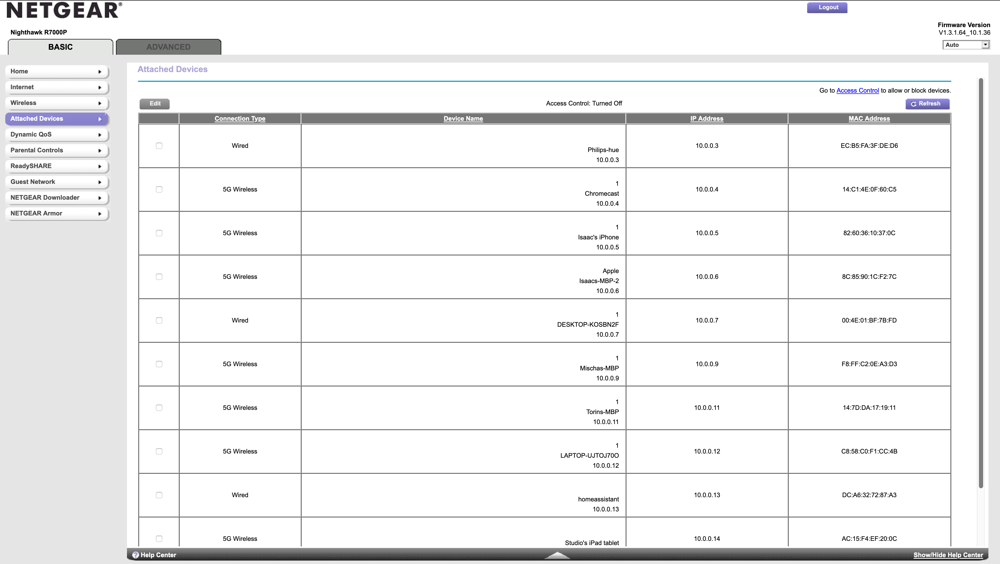

# Router Settings

Go to http://routerlogin.net/

The username is always admin and the password is the same one you set during the inital setup process.

... Inital router site screen ... 

## Check connected devices 

You can check the devices connected to our network by going under the **BASIC** tab and click on Attached Devices option. It will display the devices and their assigned network IP address. 

## Assigning static IP 

You can check assign a static IP adress by going under the **ADVANCED** tab and go under setup > LAN Setup

Typically we do this to assign a static IP address on the Chromecast because the connection between the chromecast and the router sometimes can disconnect. 

Click on the device you want to edit and manaually write the IP address. Then click apply. 

